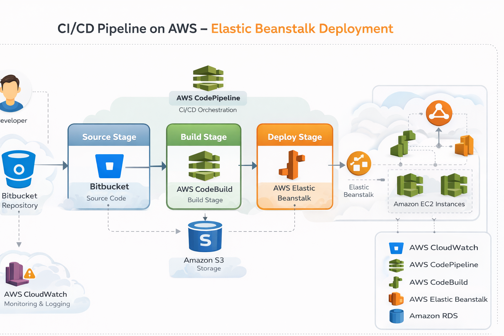
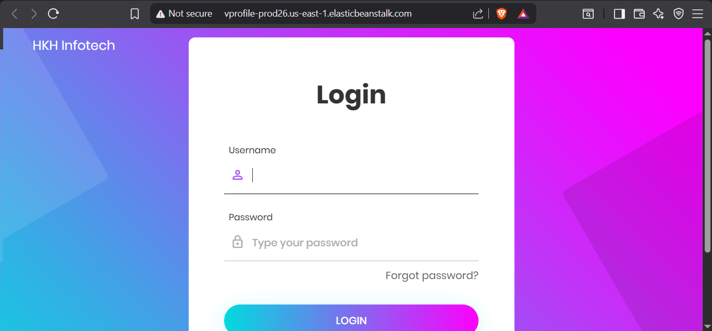
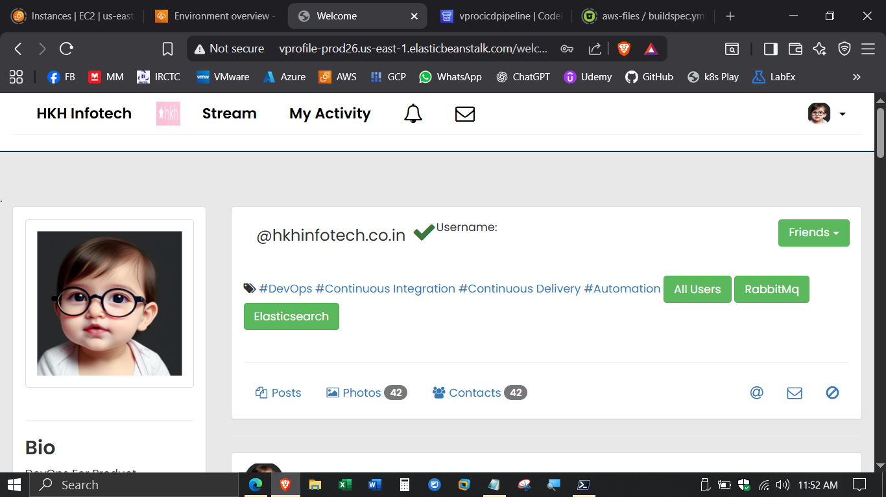
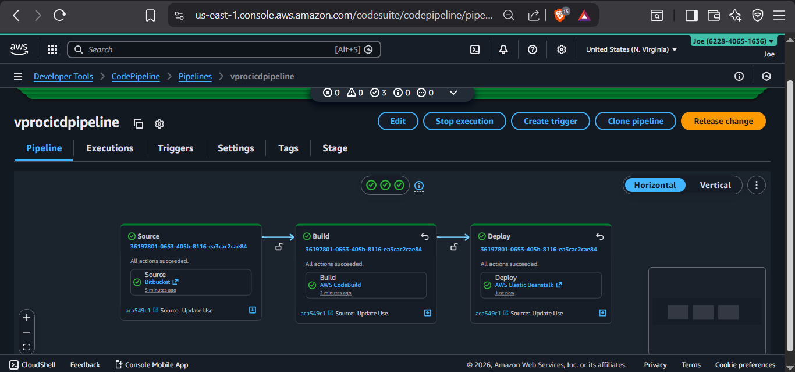

# AWS CI/CD Pipeline – Elastic Beanstalk Deployment


A production-style **CI/CD pipeline implementation on AWS** that automatically builds and deploys an application using **AWS CodePipeline, AWS CodeBuild, and AWS Elastic Beanstalk**.

This project demonstrates how modern DevOps pipelines automate application delivery from source code commit to production deployment.

---

# 🚀 Project Overview

This project implements a **fully automated CI/CD pipeline** for deploying a web application using AWS managed services.

The pipeline performs the following steps:

1. Developer pushes code to **Bitbucket repository**
2. **AWS CodePipeline** detects the change
3. Code is sent to **AWS CodeBuild**
4. Application build artifacts are generated
5. Artifacts are stored in **Amazon S3**
6. **AWS Elastic Beanstalk** deploys the new application version
7. Application runs on EC2 instances and connects to **Amazon RDS**

The result is an automated deployment pipeline that enables **fast and reliable application releases**.

---

# 🏗 Architecture Diagram



---

# ⚙️ Technology Stack

| Component            | Technology            |
| -------------------- | --------------------- |
| Source Control       | Bitbucket             |
| CI/CD Orchestration  | AWS CodePipeline      |
| Build Service        | AWS CodeBuild         |
| Artifact Storage     | Amazon S3             |
| Application Platform | AWS Elastic Beanstalk |
| Compute              | Amazon EC2            |
| Database             | Amazon RDS            |
| Monitoring           | Amazon CloudWatch     |

---

# 🔄 CI/CD Pipeline Workflow

The deployment pipeline follows this workflow:

```
Developer
   │
   ▼
Bitbucket Repository
   │
   ▼
AWS CodePipeline
   │
   ├── Source Stage
   │
   ├── Build Stage (CodeBuild)
   │
   └── Deploy Stage
           │
           ▼
    AWS Elastic Beanstalk
           │
           ▼
        EC2 Instances
           │
           ▼
        Amazon RDS
```

---

# 📦 Repository Structure

```
aws-cicd-elasticbeanstalk/
│
├── architecture/
│   ├── aws-cicd-architecture.png
│   └── pipeline-overview.png
│
├── screenshots/
│   ├── app-login.png
│   ├── app-home.png
│   └── cicd-pipeline.png
│
├── aws-files/
│   └── buildspec.yml
│
├── src/
│   └── application-source-code
│
├── docs/
│   ├── elasticbeanstalk-deployment.md
│   ├── codepipeline-setup.md
│   └── rds-setup.md
│
├── README.md
├── LICENSE
└── .gitignore
```

---

# 🔧 Build Process (CodeBuild)

The application build is handled by **AWS CodeBuild** using a `buildspec.yml` file.

Build stages:

1️⃣ Install dependencies

2️⃣ Compile application

3️⃣ Package application artifact

4️⃣ Upload artifact to S3

5️⃣ Deploy through Elastic Beanstalk

---

# 🚀 Deployment using Elastic Beanstalk

Elastic Beanstalk simplifies application deployment by automatically provisioning:

* EC2 instances
* Load balancer
* Auto Scaling
* Health monitoring
* Deployment management

Application versions are deployed directly from **CodePipeline**.

---

# 🖥 Application Screenshots

### Login Page



---

### Application Dashboard



---

### CI/CD Pipeline Execution



---

# 📊 DevOps Concepts Demonstrated

This project demonstrates key DevOps practices:

* CI/CD pipeline automation
* Infrastructure managed by AWS services
* Automated build and deployment
* Artifact management
* Environment configuration
* Continuous delivery pipeline

---

# 🔐 Security Considerations

The deployment includes the following security controls:

* IAM roles for CodePipeline and CodeBuild
* Secure database connectivity
* Controlled deployment permissions
* AWS managed infrastructure security

---

# 📈 Possible Improvements

Future improvements for this project include:

* Infrastructure as Code using Terraform
* Blue/Green deployments
* Monitoring dashboards
* Containerized deployment using ECS/EKS
* GitHub Actions integration

---

# 🎯 Learning Outcomes

Through this project the following skills were demonstrated:

* Designing CI/CD pipelines on AWS
* Automating application deployment
* Using managed platform services
* Integrating build and deployment tools
* Production-style DevOps workflow

---

# 👨‍💻 Author

DevOps Engineer Portfolio Project

AWS | CI/CD | Kubernetes | Cloud Infrastructure
